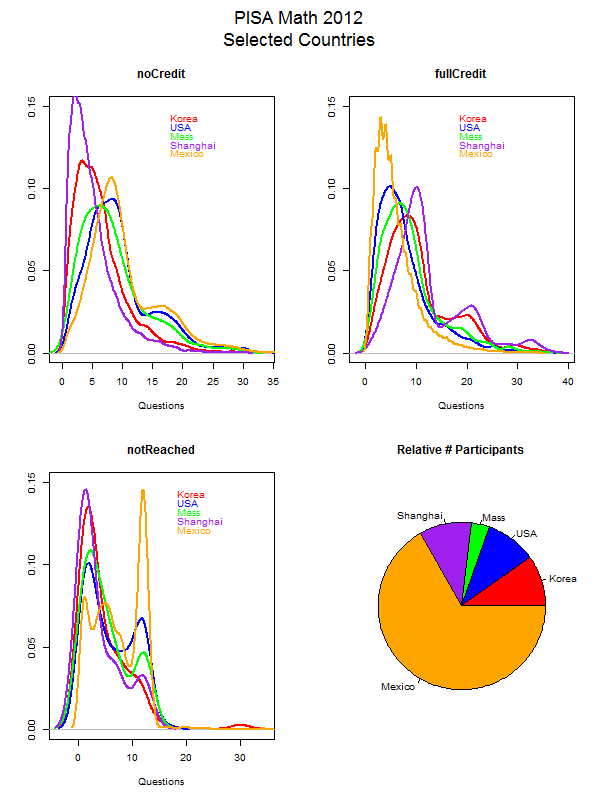
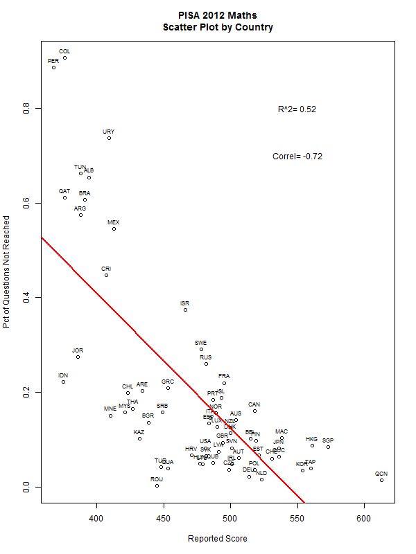

##PISA extract

This repository consists of the following files:

* <b>codebook</b>: Dataframe ready tab delimitted text file with variable definitions taken from the <a href="http://pisa2012.acer.edu.au/downloads/M_cogn_codebook.pdf">PISA cognitive code book</a>.

* <b>scores</b>: Dataframe ready tab delimitted text file with questions, valid response code and value, summary frequency and percentage statitsics taken from the <a href="http://pisa2012.acer.edu.au/downloads/M_cogn_codebook.pdf">PISA cognitive code book</a>.

* <b>M_cogn_codebook.pdf</b>: A copy of the <a href="http://pisa2012.acer.edu.au/downloads/M_cogn_codebook.pdf">PISA cognitive code book</a> pdf document:

* <b>pisa.R</b>: R script that reads in codebook, scores, downloads the raw data file from the PISA website and produces two charts for analysis.

* <b>pisa.R</b>: R script that reads in codebook, scores, downloads the raw data file from the PISA website and produces two charts for analysis.

* <b>maths2012.zip</b>: Compressed zip file of a tab delimitted text file created in pisa.R script that contains summary information including country code, school id, student id, and seven columns of aggregated response data for the 74 2012 Maths test.  Useful for doing further analysis without processing the entire raw data file.

* <b>2 PNG charts</b>: See below.

* <b>Dataset</b>: NOT included in this repos.  On the <a href="http://pisa2012.acer.edu.au/downloads.php">PISA data download page</a> there is the <a href="http://pisa2012.acer.edu.au/downloads/INT_COG12_DEC03.zip">cognitive raw dataset</a> [27Mb] compressed, [189M] uncompressed.

## Loading the data

When loading the dataset into R, please consider the following:

* The dataset has 485,490 rows and 264 columns. First
calculate a rough estimate of how much memory the dataset will require in memory before reading into R. Make sure your computer has enough memory (most modern computers should be fine).

* We will only be using data from the dates 2012 PISA Maths test.  One alternative is to read the data from just those dates
rather than reading in the entire dataset and subsetting to those dates.

## Performing Analysis

Our overall goal here is simply to become familiar with the PISA test data and performing some rudimentary analysis.

First you will need to fork and clone the following GitHub repository:
[https://github.com/StephenHarrington/PISA](https://github.com/StephenHarrington/PISA)

The four plots that the R script constructs are shown below. 

### Plot Raw Reponse Data

 

### Scatter Plot of %of Questions Unansered Vs Normalized Scores

 
